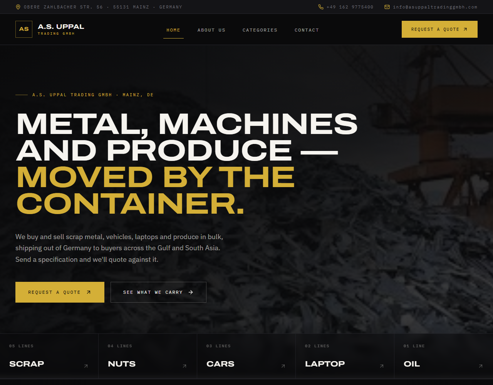

<div align="center">

# A.S. Uppal Trading GmbH

**Marketing site for a Mainz-based bulk trading house dealing in scrap metal, vehicles, laptops and produce.**

[](https://react.dev)
[](https://vite.dev)
[](https://tailwindcss.com)
[](https://typescriptlang.org)
[](https://reactrouter.com)



</div>

---

## Overview

A.S. Uppal Trading GmbH buys and sells goods in container quantities out of Mainz, Germany,
shipping to buyers across Europe, the Gulf and South Asia. This is the company's public site:
a catalogue of what's on the book, and a way for buyers to send a specification and get a
quote back.

The catalogue covers **five classes across 15 product lines** — scrap metal, nuts and dry
fruit, vehicles, laptops and cooking oil — each drilling down from a class page to a line
page with a full specification table.

## Features

- **Catalogue browsing** — class index → product lines → per-line specification plate
  (type, purity, packaging, minimum order, price basis, delivery terms).
- **Quote enquiry form** — sends through [EmailJS](https://www.emailjs.com) with inline
  success and failure states; no backend required.
- **Motion throughout** — scroll reveals, an auto-advancing testimonial carousel, a
  commodity marquee, and count-up statistics. All of it honours
  `prefers-reduced-motion`.
- **Responsive** from 360px up, with a full-screen mobile navigation sheet.
- **Accessible** — labelled form fields, visible focus rings, keyboard-operable carousels,
  `aria-live` status messages, and semantic landmarks.

## Tech stack

| Layer | Choice | Why |
| --- | --- | --- |
| Build | Vite 8 | Replaced Create React App, which was unmaintained and pulling ~10 unfixable advisories. |
| UI | React 19 | — |
| Routing | React Router 8 | v8 consolidated everything into `react-router`; `react-router-dom` has no v8 release. |
| Styling | Tailwind CSS 4 | Configured in CSS via `@theme`, no `tailwind.config.js`. |
| Animation | Motion 12 | `whileInView` reveals, `AnimatePresence` slides, `useMotionValue` counters. |
| Icons | lucide-react | — |
| Types | TypeScript 5.9 | Pages and components are `.tsx`; the entry and route table stay `.jsx`. |
| Tests | Vitest + Testing Library | jsdom environment. |

## Getting started

**Prerequisites:** Node.js 20.19+ or 22.12+ (developed on Node 24).

```bash
git clone https://github.com/Abdullahahmad666/business-website.git
cd business-website
npm install
npm run dev
```

The dev server starts on **http://localhost:3000** and opens a browser automatically.

## Scripts

| Script | Description |
| --- | --- |
| `npm run dev` | Start the Vite dev server with HMR (`npm start` is an alias). |
| `npm run build` | Production build into `dist/`. |
| `npm run preview` | Serve the built `dist/` locally to check it before deploying. |
| `npm test` | Run the Vitest suite once. |
| `npm run test:watch` | Run Vitest in watch mode. |
| `npm run typecheck` | Type-check the sources with `tsc --noEmit`. |

## Project structure

```
index.html                  Vite entry point — must stay at the repo root
docs/                       README assets
public/
  asuppal/                  Product, category and warehouse imagery
src/
  main.jsx                  Bootstrap: fonts, styles, <BrowserRouter>
  App.jsx                   Layout shell (Header / <main> / Footer) + route table
  index.css                 Tailwind entry, @theme design tokens, base layer
  data/
    company.ts              Single source of truth for all company facts
  lib/
    utils.ts                cn() — clsx + tailwind-merge
  Components/
    Header.tsx              Fixed header, retracting utility strip, mobile sheet
    Footer.tsx              Closing CTA, colophon, legal bar
    ui/
      Reveal.tsx            Scroll-reveal and staggered-group primitives
      Manifest.tsx          SpecLabel / SectionTitle / Rule
      Button.tsx            Button and ButtonLink variants
      Marquee.tsx           Continuous commodity band
      Testimonials.tsx      Auto-advancing carousel
      CountUp.tsx           Count-to-value statistic
  Pages/
    Home.tsx                Hero, catalogue ledger, services, mission, team
    AboutUs.tsx             Company profile, yard gallery, track record
    Categories.tsx          Class index
    SubcategoryPage.tsx     Lines within a class      (/categories/:category)
    ProductDetailPage.tsx   Line detail + spec plate  (/products/:subcategory)
    Contact.tsx             Enquiry form
```

## Architecture notes

### One source of truth for company data

Contact details, the team roster, the catalogue index and the statistics all live in
[`src/data/company.ts`](src/data/company.ts). These were previously duplicated across four
pages and had already drifted — Home and About Us disagreed on who held which job title.
Every page reads from that module now.

### Design tokens in CSS

Tailwind 4 is configured through an `@theme` block in
[`src/index.css`](src/index.css) rather than a JS config file. The palette (`ink`, `gold`,
`bone`) and the three type roles are declared there and consumed as ordinary utilities —
`bg-ink`, `text-gold`, `font-display`.

Typography uses three self-hosted faces: **Archivo** on its width axis (`wdth 125`) for
display, **IBM Plex Sans** for body, and **IBM Plex Mono** for figures and labels.

### Cascade layers

`index.css` declares an explicit layer order:

```css
@layer theme, base, brand, components, utilities;
```

`brand` holds the base element styling, so Tailwind utilities in the final layer always win
over it without needing `!important`.

### Reduced motion

Every animated component checks `useReducedMotion()` and renders its resting state
directly. The global rule in `index.css` also collapses transition and animation durations
under `prefers-reduced-motion: reduce`.

### Contact form

[`src/Pages/Contact.tsx`](src/Pages/Contact.tsx) posts through EmailJS. The service ID,
template ID and public key are inlined — EmailJS public keys are designed to be
client-visible, so this is expected. Restrict the allowed domains in the EmailJS dashboard
rather than trying to hide them.

## Deployment

The build output is a static bundle in **`dist/`** — not `build/`. A host that assumes
Create React App will look for `build/` and fail with
*"No Output Directory named 'build' found"*.

Routing is also client-side, so the host must rewrite unknown paths to `index.html` or deep
links such as `/categories/scrap` will 404 on refresh.

[`vercel.json`](vercel.json) covers both:

```json
{
  "framework": "vite",
  "outputDirectory": "dist",
  "rewrites": [{ "source": "/(.*)", "destination": "/index.html" }]
}
```

<details>
<summary>Other hosts</summary>

**Netlify** — `netlify.toml`:

```toml
[build]
  command = "npm run build"
  publish = "dist"

[[redirects]]
  from = "/*"
  to = "/index.html"
  status = 200
```

**Nginx** — serve `dist/` with:

```nginx
location / {
  try_files $uri $uri/ /index.html;
}
```

</details>

## Contributing

Before opening a pull request, make sure all three pass:

```bash
npm run typecheck
npm test
npm run build
```

## License

Proprietary. © A.S. Uppal Trading GmbH. All rights reserved.

## Contact

**A.S. Uppal Trading GmbH**
Obere Zahlbacher Str. 56, 55131 Mainz, Germany
[info@asuppaltradinggmbh.com](mailto:info@asuppaltradinggmbh.com) · +49 162 9775400
